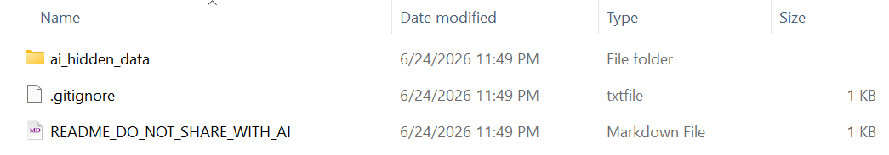
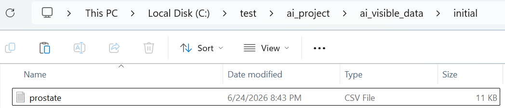
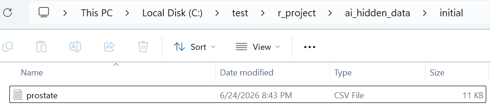

<!-- README.md is generated from README.Rmd. Please edit that file -->

```{r, include = FALSE}
knitr::opts_chunk$set(
  collapse = TRUE,
  comment = "#>",
  fig.path = "man/figures/README-",
  out.width = "100%"
)
```

# Setup AI-assisted R analysis project structures

<!-- badges: start -->
<!-- badges: end -->

Clear boundaries, flexible QC, and traceable structure for AI-assisted R
analysis.

`airsetup` creates a small, opinionated folder structure for R analysis projects
where AI agents help write scripts, inspect visible dummy data, and review
outputs, while hidden analysis data stays outside the AI-visible workspace.

It does not provide statistical analysis functions. Instead, it prepares separated folders, a minimal `AGENTS.md`, a `QC_STATUS.md` tracker, optional lightweight QC skill templates for context review, general plan review, clinical SAP review, result review, and M11-informed semantic review, and optional independent QC agent scaffolding.

## Installation

You can install the development version of airsetup from GitHub with:

``` r
# install.packages("pak")
pak::pak("gestimation/airsetup")
```

## Basic use

```{r example, eval = FALSE}
library(airsetup)

project_dir <- file.path(tempdir(), "my_analysis")

airsetup(
  path = project_dir,
  qc_agent = TRUE,
  japanese = TRUE
)

aircheck(project_dir, qc_agent = TRUE)

airsetup("project")
airsetup("project", qc_agent = TRUE)
airsetup("project", split = FALSE)
airsetup("project", skills = FALSE)

# Add only the SAP QC skill to an existing airsetup project
airskill("project", skills = "sap")
```

By default, `airsetup()` uses `split = TRUE`, `skills = TRUE`, and
`qc_agent = FALSE`. With `split = TRUE`, it creates two sibling folders:

```text
my_analysis/
+-- ai_project/
+-- r_project/
```


## What airsetup creates

`ai_project/` is the workspace AI agents may inspect and edit according to the
project rules.


It contains folders for source materials, AI-visible data, AI-generated files, R
outputs, QC evidence, logs, and AI/agent control files:

- `source/`: source specifications, reference documents, and analysis
  instructions, such as protocols, SAPs, and database definitions.
- `ai_visible_data/`: dummy or visible data that AI agents may inspect.
- `ai_output/`: scripts and supporting files generated by AI agents.
- `r_output/`: outputs produced when R scripts are run by the user.
- `qc/`: QC evidence, review materials, comparison files, and discrepancy notes.
- `log/`: notes, decision records, and investigation logs.
- `agent_control/`: agent role definitions, agent control index, and generated
  QC skill templates.
- `AGENTS.md`: working rules for AI agents.
- `QC_STATUS.md`: the current QC status and open review items.

With `split = TRUE`, `r_project/` is also created next to `ai_project/`.



It contains a hidden-data area and local reminders:

- `ai_hidden_data/`: analysis data that AI agents must not inspect directly.
- `.gitignore`: defaults that avoid committing hidden analysis data.
- `README_DO_NOT_SHARE_WITH_AI.md`: a local reminder that this folder is for
  human/R execution, not AI inspection.

## Generated folders and files

`airsetup` separates files created by package functions from files that AI agents
may create later during planning, QC, and coding.

| Created by | Path | Role |
|---|---|---|
| `airsetup()` | `ai_project/source/` and `ai_project/source/initial_YYYYMMDD/` | Source and reference materials visible to AI. |
| `airsetup()` | `ai_project/ai_visible_data/` and `ai_project/ai_visible_data/initial_YYYYMMDD/` | Dummy or visible data that AI may inspect. |
| `airsetup()` | `ai_project/ai_output/` | AI-generated scripts, plans, notes, and working outputs. |
| `airsetup()` | `ai_project/r_output/` | Outputs from R scripts that the user runs. |
| `airsetup()` | `ai_project/qc/` | QC reports, review evidence, discrepancy notes, and QC summaries. |
| `airsetup()` | `ai_project/log/` | Work logs and decision records. |
| `airsetup()` | `ai_project/agent_control/` | AI/agent control files, agent role definitions, and QC skill templates. |
| `airsetup()` | `ai_project/agent_control/AGENT_CONTROL_INDEX.md` | Index and selection guide for agent control files. |
| `airsetup()` | `ai_project/AGENTS.md` | Working rules for AI agents. |
| `airsetup()` | `ai_project/QC_STATUS.md` | Current QC status, open questions, and links to detailed QC materials. |
| `airsetup(split = TRUE)` | `r_project/ai_hidden_data/` and `r_project/ai_hidden_data/initial_YYYYMMDD/` | Analysis data area that AI must not inspect. |
| `airsetup(split = TRUE)` | `r_project/.gitignore` | Defaults that avoid committing hidden analysis data. |
| `airsetup(split = TRUE)` | `r_project/README_DO_NOT_SHARE_WITH_AI.md` | Local reminder that the folder is for human/R execution. |
| `airskill()` | `ai_project/agent_control/QC_SKILL_CONTEXT.md` | Lightweight context QC skill. |
| `airskill()` | `ai_project/agent_control/QC_SKILL_PLAN.md` | General coding-plan and analysis-specification QC skill. |
| `airskill()` | `ai_project/agent_control/QC_SKILL_SAP.md` | Evidence-first clinical-trial SAP QC skill. |
| `airskill()` | `ai_project/agent_control/QC_SKILL_RESULT.md` | Result consistency and interpretation QC skill. |
| `airskill()` | `ai_project/agent_control/QC_SKILL_M11SEMANTIC.md` | M11 SEMANTIC QC skill for evidence-based semantic organization across complex clinical-trial materials. |
| `airsetup(qc_agent = TRUE)` | `ai_project/agent_control/WORKFLOW_AGENT.md` | Workflow agent role and Plan gate constraints. |
| `airsetup(qc_agent = TRUE)` | `ai_project/agent_control/QC_AGENT.md` | Independent QC agent role and decision rules. |
| `airsetup(qc_agent = TRUE)` | `ai_project/qc/review/` | Independent QC review and decision areas. |
| `airsetup(qc_agent = TRUE)` | `ai_project/log/QC_REVIEW_LOG.md` and `ai_project/log/DECISION_LOG.md` | QC review and decision logs. |
| `airsetup_demo()` | `ai_project/source/initial_YYYYMMDD/definition_demodata.txt` | Demo data definition. |
| `airsetup_demo()` | `ai_project/ai_visible_data/initial_YYYYMMDD/demodata.rds` | AI-visible demo data. |
| `airsetup_demo()` | `r_project/ai_hidden_data/initial_YYYYMMDD/demodata.rds` | Demo R-execution data. |

Some files are not created automatically. They are recommended output locations
for AI agents when the relevant workflow step is actually performed.

| Workflow step | Recommended path | Role |
|---|---|---|
| CONTEXT QC | `ai_project/qc/context-qc-001.md` | Lightweight context QC report. |
| PLAN QC | `ai_project/qc/plan-qc-001.md` | General coding-plan QC report. |
| SAP QC | `ai_project/qc/sap-qc-001.md` | Clinical-trial SAP completeness and implementation-readiness QC report. |
| RESULT QC | `ai_project/qc/result-qc-001.md` | Analysis result QC report. |
| SAP drafting, when useful | `ai_project/ai_output/SAP.md` | Draft project-specific SAP or analysis specification. |
| SAP decisions, when useful | `ai_project/ai_output/SAP_DECISIONS.md` | Source-specified, user-approved, proposed, and unresolved analysis decisions. |
| M11 SEMANTIC QC — semantic map | `ai_project/ai_output/m11semantic/M11SEMANTIC_MAP.md` | M11-informed semantic map for R planning and code generation. |
| M11 SEMANTIC QC — QC summary | `ai_project/qc/m11semantic/M11SEMANTIC_QC_SUMMARY.md` | QC-oriented readiness summary for the M11 semantic map. |

## Clear boundaries with separated folders

The package separates what AI can inspect from what R can use for real analysis.
The visible and hidden data areas would share the same internal structure:

```text
ai_project/ai_visible_data/initial_YYYYMMDD/
r_project/ai_hidden_data/initial_YYYYMMDD/
```

For example, a small AI-visible data set `demodata.rds` may be placed in
`ai_project/ai_visible_data/initial_YYYYMMDD/`, while a full analysis data set
with the same file name and the same data structure may be placed in
`r_project/ai_hidden_data/initial_YYYYMMDD/`.





This lets AI agents design scripts against visible data while R scripts can be
run against hidden data by changing the input root, without asking AI to inspect
the hidden files.

## What AGENTS.md tells AI agents

The generated `AGENTS.md` is intentionally practical. It tells AI agents:

- which folders they may inspect;
- that `../r_project/ai_hidden_data/` must not be listed, opened, copied,
  summarized, or otherwise inspected;
- where to place generated scripts and supporting files;
- where R outputs and QC evidence should live;
- to check `QC_STATUS.md` before substantive work;
- to distinguish AI risk assessment from user-approved QC decisions;
- to separate document facts, candidate inferences, unresolved issues, and
  implementation assumptions;
- not to silently assume treatment-group coding, endpoint-variable mapping,
  analysis-set flags, visit coding, or missing-value coding;
- that Workflow agent outputs belong under `ai_output/`, QC agent outputs belong
  under `qc/`, and QC agents must not directly overwrite Workflow outputs;
- that detailed agent role definitions and QC skill instructions are stored
  under `agent_control/`;
- to ask for human approval when a decision requires domain judgment.

The generated file is not an access-control mechanism. It is a project-level
working rule that makes the boundary explicit and repeatable.

When `qc_agent = TRUE`, `AGENTS.md`, `agent_control/WORKFLOW_AGENT.md`, and
`agent_control/QC_AGENT.md` all state the Plan gate rule: the Workflow agent
must not proceed to final R code generation until the QC agent records
`APPROVE_NEXT_STEP`. Before that approval, context confirmation, M11 SEMANTIC QC,
extraction, SAP or analysis-plan drafting, data requirements tables, endpoint
map drafts, metadata inspection plans, and pseudocode are allowed. Final R
analysis scripts, final endpoint or analysis-set derivation code, final
table/figure scripts, and final statistical model implementations are not.

## Flexible QC and traceability

`airsetup` does not prescribe one QC method. A project might use double
programming, output review, row-count checks, discrepancy tables, or another
context-specific workflow.

The package simply gives QC a stable place:

- `qc/` for evidence and review materials;
- `QC_STATUS.md` for current status, open questions, and human review items;
- `log/` for decisions and investigation notes that matter later.

As data batches, scripts, outputs, and QC evidence evolve, the structure keeps
those materials separated instead of mixing them into one working directory.

## What the QC skills are for

The generated skill files are intended to support self-checking steps in an AI-assisted R workflow.

For selection guidance, decision rules, output schemas, and worked examples in Japanese, see the [airsetup QC skills user guide](https://gestimation.github.io/airsetup/articles/qc-skills-jp.html).

- `QC_SKILL_CONTEXT.md`: checks whether the supplied analysis context is clear enough before drafting a plan or generating R code.

- `QC_SKILL_PLAN.md`: checks whether a general coding plan or non-SAP analysis specification is clear enough for R implementation.

- `QC_SKILL_SAP.md`: performs evidence-first clinical-trial SAP QC using a paraphrased 55-item SAP checklist and an M11/E9(R1)-informed supplement. It can use `M11SEMANTIC_MAP.md` or the supplied protocol when available, but can also review the SAP alone. Unavailable cross-document evidence is reported as `Cannot assess`, not completed by assumption.

- `QC_SKILL_RESULT.md`: checks whether analysis results are internally
consistent, traceable, aligned with the plan, and safe to interpret.

- `QC_SKILL_M11SEMANTIC.md`: supports evidence-first M11-informed semantic organization across multiple clinical-trial materials before R planning or R coding. It uses a compact analysis-critical map and should be used only for M11/electronic-protocol tasks or complex clinical-trial semantic review, not ordinary context QC.

- `AGENT_CONTROL_INDEX.md`: explains the agent control files and available QC
  skills.

`QC_SKILL_PLAN.md` and `QC_SKILL_SAP.md` are normally alternative review tracks. Across the clinical skills, the governing rule is: no evidence, no study-specific assertion.

The skills use a compact QC report format with domain-level status, issue severity, readiness for next steps, cannot-assess items, AI assumption risks, and recommended handoff actions.

They are intentionally lightweight. A Pass from these skills does not mean formal statistical approval, independent validation, regulatory approval, or final scientific acceptance. 

## Check the required structure

Use `aircheck()` to verify that the required folders and files exist.

```{r aircheck-example, eval = FALSE}
aircheck("example-analysis")
aircheck("example-analysis", qc_agent = TRUE)
```

`aircheck()` returns a data frame with one row per required item. It reports
whether each folder or file was found.

This makes it easy to confirm that the workspace still has the structure that
AI-assisted analysis depends on.
