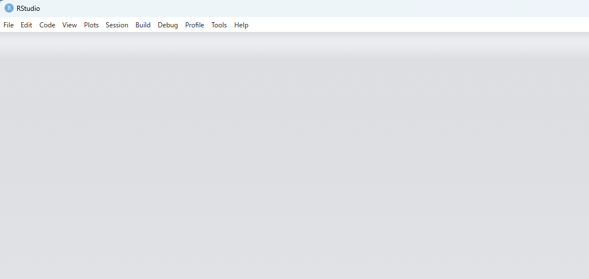

# Getting started with AI & R workflows

Have you ever wanted a simple way to separate the workspace where you
run statistical analyses from the workspace an AI agent is allowed to
inspect? Or have you grown tired of moving back and forth between
RStudio and ChatGPT? This site introduces an AI-assisted R workflow.

## By simply organizing the folder structure

- AI agents can more easily understand the workflow and context.
- Users can more easily manage what AI is allowed to access.
- QC results and logs can remain in predictable places.

``` r

# Read the package and specify the path
library(airsetup)
airsetup("C:/demo")
```


Folder structure generated by
[`airsetup()`](https://gestimation.github.io/airsetup/reference/airsetup.md)

The important point is not to ask AI to run straight into the analysis.
This workflow follows a few simple principles.

- Separate the AI agent workspace from the RStudio workspace
- Separate planning from coding
- Build quality control (QC) into the statistical analysis workflow
- Support working records for statistical analysis workflows
- Keep the user responsible for decisions, result interpretation, and
  outputs

The `airsetup` package introduced here creates folders for an
AI-assisted R workflow. It does not provide statistical analysis
functions. Instead, it provides a folder structure, a minimal
`AGENTS.md`, a `QC_STATUS.md` tracker, and optional QC skill templates.

There is no single correct way to check coding accuracy or perform QC.
One project might use double programming, while another might use visual
review. To support self-QC in AI & R workflows, lightweight QC skill
templates are available.

## Tutorial 1. Setup

Follow these three tutorials to experience the AI & R workflow. The
first tutorial covers setup before asking AI agent to work on a task.
We’re using the Codex app here, but there are no specific restrictions
regarding AI agent tools.

### Step 1. Install R, RStudio, `airsetup` and Codex app

- Install R
- Download the RStudio installer from the [Posit
  site](https://posit.co/downloads)
- Download the Codex app installer from the [OpenAI
  site](https://openai.com/ja-JP/codex)
- Install `airsetup` from GitHub with:

``` r

# install.packages("pak")
pak::pak("gestimation/airsetup")
```

### Step 2. Create a project folder with airsetup

- Run
  [`airsetup()`](https://gestimation.github.io/airsetup/reference/airsetup.md)
  to create folders and Markdown files:
  - `AGENTS.md`
  - `QC_STATUS.md`
- Through `AGENTS.md`, instruct AI to separate the AI workspace from the
  R workspace and to support QC.

``` r

library(airsetup)
airsetup("C:/demo")
```


AI agent and RStudio workspaces

### Step 3. Prepare dummy data and context materials

- Prepare AI-visible dummy data separately from the data used for R
  execution.
- Prepare materials related to the statistical analysis for AI to
  reference. Study protocols and database definitions are often useful
  context.

## Tutorial 2. Planning

In the second tutorial, you will give Codex instructions and ask it to
plan a statistical analysis and R coding workflow. From this point
onward, the tutorial uses the demo-only
[`airsetup_demo()`](https://gestimation.github.io/airsetup/reference/airsetup_demo.md)
function to analyze the `prostate` dataset included in `airsetup`. In
Step 1, if a project folder already exists, the demo files are added to
that folder.

### Step 1. Place files in the project folder

- Place AI-visible dummy data and R-execution data in the corresponding
  folder structures.
- In this demo, the dummy data uses the first three rows extracted from
  the `prostate` dataset.
- Use the information from `prostate.Rd` as context.
- The following R code should place the context, dummy data, and
  R-execution data in the project folder.

``` r

# Check the first rows and structure of the data
data(prostate, package = "airsetup")
head(prostate)
str(prostate)

# Create folders and place files: context, dummy data, and R-execution data
root_dir <- "C:/demo"
airsetup_demo(root_dir)
```

### Step 2. Start a Codex project

- Start Codex and select the `ai_project` folder as the project folder.
- Enter a prompt in Codex.

``` text
Prompt: "Please inspect the files in ai_project folder."
```

### Step 3. Review a coding plan with Codex

- Enter prompts in Codex.
- Ask Codex to create an R-script coding plan, then review through chat
  whether the plan is appropriate.
- If the plan looks acceptable, approve it and move on to coding.

``` text
Prompt: "Please refer to demodata.rds and definition_demodata.txt. The goal
of this analysis is to describe the outcome, cancer death, using a flowchart and 
cumulative incidence curves by treatment groups. The event of interest is cancer death. 
Deaths other than cancer death should be treated as competing risks. The planned 
coding for the event variable epsilon is 0 = alive/censored, 1 = cancer death, and
2 = non-cancer death. For the flowchart generation, refer to 
https://gestimation.github.io/cifmodeling/reference/cifflowchart.html. 
For the cumulative incidence curve estimation method,
refer to https://gestimation.github.io/cifmodeling/reference/cifplot.html.
First, use the QC skill to evaluate whether the context is clear enough to
proceed to R coding."
```

``` text
Prompt: "Based on the QC results, please create an R-script coding plan."
```

``` text
Prompt: "Use the QC skill to evaluate the coding plan."
```

## Tutorial 3. Coding

In the third tutorial, you ask Codex to write R scripts that produce
analysis results using the R-execution data, following the coding plan
Codex created and you approved.

### Step 1. R coding and QC with Codex

- Enter a prompt in Codex.
- Ask Codex to write R scripts, then use chat as needed to ask questions
  and check whether the scripts are correct.

``` text
Prompt: "Please write the R scripts. I need both an R script for the
AI-checkable dummy data and an R script for R execution. Pay attention to the
RStudio working directory. I would prefer not to have to set it manually."
```

### Step 2. Run R in RStudio



RStudio interface

- Load the R scripts generated in the `ai_output` folder into RStudio
  and run them.
- Be careful with the RStudio working directory. Code that depends on
  the working directory may not run in every environment.
- In that case, specifying the input dataset location may solve the
  problem (replace `YYYYMMDD` with the execution date).

``` r

options(DEMODATA_RDS = "C:/demo/r_project/ai_hidden_data/initial_YYYYMMDD/demodata.rds")
```

- Alternatively, you can manually set the working directory.

``` r

setwd("C:/demo/r_project/ai_hidden_data")
```

### Step 3. Review results with Codex

- Check the figures generated in the `r`\_output\` folder.
- With support from Codex, perform the final review of whether the
  analysis results are correct.


Expected analysis result (flow chart, it may be further stratified to
group)


Expected analysis result (cumulative incidence curves)

## Final remark

You can install the development version of `airsetup` from GitHub with:

``` r

# install.packages("pak")
pak::pak("gestimation/airsetup")
```

Since this package is still in alpha, it has not yet been submitted to
CRAN, but it has passed more than 100 tests using `testthat`. Running
[`airsetup()`](https://gestimation.github.io/airsetup/reference/airsetup.md)
has no effect on any paths other than the one specified.

In this tutorial using
[`airsetup_demo()`](https://gestimation.github.io/airsetup/reference/airsetup_demo.md),
an optional QC skill template is generated in the agent_control/skills
folder. By specifying a skill in the prompt, you can perform
higher-quality QC tasks.

- `QC_SKILL_CONTEXT.md`: checks whether the context is clear enough
  before drafting a plan or writing R code.
- `QC_SKILL_PLAN.md`: checks whether a coding plan or SAP contains
  enough information for R implementation.
- `QC_SKILL_RESULT.md`: checks whether analysis results are internally
  consistent, aligned with the plan, and safe to interpret.
- `QC_SKILL_M11SEMANTIC.md`: supports M11-informed semantic organization
  across multiple clinical-trial materials before R planning or R
  coding. It is generated by default but should be used only for
  M11/electronic-protocol tasks or complex clinical-trial semantic
  review, not ordinary context QC.

If you’re interested in how AI behaves within this workflow, please take
a look at the `AGENTS.md` file, the folder structure, and the context
documentation generated by
[`airsetup_demo()`](https://gestimation.github.io/airsetup/reference/airsetup_demo.md).

``` r

library(airsetup)
airsetup_demo("C:/demo")
```
