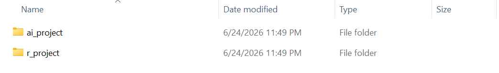
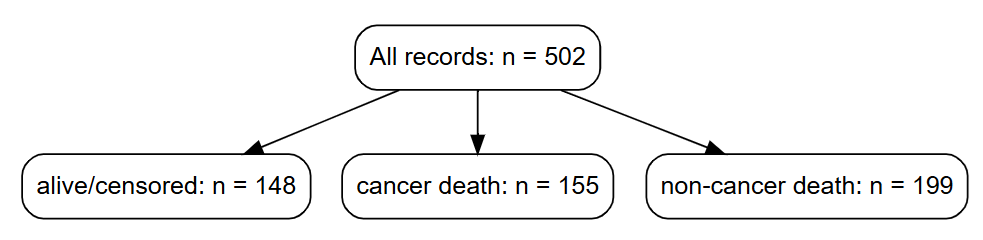
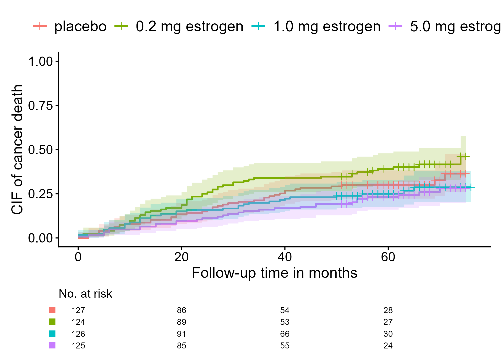

```{r, include = FALSE}
knitr::opts_chunk$set(
  collapse = TRUE,
  comment = "#>",
  fig.path = "figures/getting-started-",
  out.width = "100%"
)
```


あなたが統計解析を行う作業領域と、AIエージェントがアクセスする領域を、簡単に分けたいと思ったことはありませんか？あるいは、RStudioとChatGPTを何度も往復する作業に疲れていませんか？このサイトでは、AI支援型Rワークフローを紹介しています。

## フォルダ構造を整えるだけで
- AIエージェントがワークフローとコンテキストを理解しやすくなり、
- AIのアクセス権限をユーザーが管理しやすくなり、
- 決まった場所に品質管理結果やログが残るようになる

```r
# パッケージを読み込んで、パスを指定するだけ
library(airsetup)
airsetup("C:/demo")
```

<figure>

<figcaption aria-hidden="true">`airsetup()`が生成するフォルダ構造</figcaption>
</figure>

重要なのは、AIにいきなり解析を頼まないことです。このワークフローはいくつかのシンプルな原則に従っています。

- AIエージェントとRStudioの作業空間を分離する
- プランニングとコーディングを分離する
- 統計解析ワークフローに品質管理（QC）を組み込む
- 統計解析ワークフローの作業記録を支援する
- ユーザーは意思決定、結果解釈、アウトプットについて責任を持つ

これから紹介する`airsetup`パッケージは、AIエージェントが支援するRワークフローのためのフォルダを生成します。統計解析のための関数は提供されませんが、その代わりフォルダ構造、最小限の`AGENTS.md`、`QC_STATUS.md`トラッカー、そしてオプションとしてQCスキルテンプレートが用意されています。

コーディングの正確性を確認し、QCを行う方法は1つではありません。あるプロジェクトではダブルプログラミングを採用するかもしれませんし、別のプロジェクトでは目視チェックを行うかもしれません。AI & Rワークフローにおける自己QCをサポートするために、コンテキスト、統計解析計画（SAP）、解析結果を確認するための軽快なQCスキルテンプレートが利用できます。

## チュートリアル1. セットアップ

3つのチュートリアルに従って、AI & Rワークフローを体験してみてください。最初のチュートリアルでは、AIエージェントにタスクを依頼する前の環境設定までを扱います。ここではCodexアプリを用いていますが、AIエージェントツールに関する制約は特にありません。

### ステップ1. R、RStudio、`airsetup`パッケージ、Codexアプリをインストール

- R本体をインストール
- RStudioインストーラーを[Positサイト](https://posit.co/downloads)からダウンロード
- Codexアプリインストーラーを[OpenAIサイト](https://openai.com/ja-JP/codex)からダウンロード
- `airsetup`パッケージをGitHubからインストール

``` r
# install.packages("pak")
pak::pak("gestimation/airsetup")
```

### ステップ2. プロジェクトフォルダ作成（airsetup）

- `airsetup()`を実行してフォルダとマークダウンファイルを作成する
  - `AGENTS.md`
  - `QC_STATUS.md`
- `AGENTS.md`を通じて、AI作業領域とR作業領域を分離し、品質管理を行うようにAIに指示する

```{r step1, eval = FALSE}
library(airsetup)

root_dir <- "C:/demo"
airsetup(root_dir)
```



### ステップ3. ダミーデータ・コンテキスト情報の準備

- R実行用の実データとは別に、AIがアクセスできるダミーデータを用意します
- AIに参照させる統計解析に関連する資料を用意します。研究計画書やデータベース定義書はコンテキストとして与えた方がよいでしょう

## チュートリアル2. プランニング

二つ目のチュートリアルでは、実際にCodexに指示を与えて、統計解析やRコーディングの計画を立てさせます。これ以降はデモ専用の関数`airsetup_demo()`を用いて、`airsetup`パッケージに含まれている`prostate`データを解析します。ステップ1では、既存のプロジェクトフォルダがあれば、その中にデモ用のファイル一式を追加します。

### ステップ1. プロジェクトフォルダへのファイル格納
- AIがアクセスできるダミーデータとR実行用データを、対応するフォルダ構造に配置する
- このデモでは、ダミーデータとして、`prostate`データから抽出した最初の3行を用いる
- コンテキストとして`prostate.Rd`の情報を用いる
- 以下のRコードによって、コンテキスト・ダミーデータ・実データがプロジェクトフォルダに格納されるはずである

```{r step2, eval = FALSE}

# データの冒頭と構造を確認
data(prostate, package = "airsetup")
head(prostate)
str(prostate)

# フォルダ作成・ファイル格納（コンテキスト・ダミーデータ・実データ）
root_dir <- "C:/demo"
airsetup_demo(root_dir)
```

### ステップ2. Codexプロジェクトの開始


- Codexを起動し、プロジェクトフォルダとしてai_projectフォルダを指定する
- Codexにプロンプトを入力する

```text
プロンプト「ai_projectフォルダ内のファイルを確認してください」
```

### ステップ3. ユーザーとCodexによるコーディングプランの確認
- Codexにプロンプトを入力する
- Rスクリプトのコーディングプランを立てさせ、チャットを通じてプランが適切かどうか確認する
- 確認して問題がなければ、承認し、コーディングに進む

```text
プロンプト「demodata.rds、data_definition_demodata.txtを参照してください。この解析は、
アウトカムであるがん死亡を、累積発生曲線を用いて記述することが目的です。関心イベントはがん死亡です。
がん死亡以外の死亡は競合リスクとして扱います。イベント変数 epsilon のコーディングは、
0 = alive/censored、1 = cancer death、2 = non-cancer deathの予定です。
治療ごとの記述してください。ランダム化・epsilonの内訳を表すフローチャートと累積発生曲線がアウトプットです。
フローチャートの推定方法は、https://gestimation.github.io/cifmodeling/reference/cifflowchart.htmlを
参考にしてください。
累積発生曲線の推定方法は、https://gestimation.github.io/cifmodeling/reference/cifplot.htmlを
参考にしてください。まずQCスキルを使い、コンテキストがRコーディングに進めるほど明確か評価してください」
```

```text
プロンプト「QCの結果を踏まえて、Rスクリプトのコーディングプランを立ててください」
```

```text
プロンプト「QCスキルを使い、コーディングプランを評価してください」
```

## チュートリアル3. コーディング

三つ目のチュートリアルでは、先ほどCodexが立て、あなたが承認したコーディングプランに従って、実データを用いた解析結果を出力するためのRスクリプトをCodexに書かせます。

### ステップ1. CodexによるRコーディングとQC
- Codexにプロンプトを入力する
- Rスクリプトをコーディングさせ、必要に応じてチャットで質問を行い、正しいかどうか確認する

```text
プロンプト「Rスクリプトを書いてください。AI確認用ダミーデータ用のRスクリプトと
R実行用のRスクリプトの両方が必要です。RStudioの作業ディレクトリに注意してください。
手動で指定する必要がない方が望ましいです」
```

### ステップ2. RStudioによるR実行


- ai_outputフォルダに生成されたRスクリプトをRStudioに読み込ませて、実行する
- RStudioの作業ディレクトリに注意すること。作業ディレクトリに依存するコードは、環境によって動かないことがある
- その場合は、入力するデータセットの場所を指定すると解決するかもしれない（`YYYYMMDD`は実行日に置き換える）

```r
options(DEMODATA_RDS = "C:/demo/r_project/ai_hidden_data/initial_YYYYMMDD/demodata.rds")
```
- または、作業ディレクトリを手動で設定することもできる

```r
setwd("C:/demo/r_project/ai_hidden_data")
```

### ステップ3. ユーザーとCodexによる結果の確認
- ai_outputフォルダに生成された図を確認する
- Codexのサポートを受けながら、解析結果が正しいか最終レビューを行う





## 最後に

`airsetup`パッケージはGitHubからインストールできます。

``` r
# install.packages("pak")
pak::pak("gestimation/airsetup")
```

このパッケージはまだアルファ版のためCRANに提出していませんが、`testthat`を用いた100件以上のテストに合格しています。`airsetup()`を実行した結果、指定したパス以外に影響を与えることはありません。

`airsetup_demo()`を用いたこのチュートリアルでは、オプションのQCスキルテンプレートがsource/skillsフォルダ内に生成されています。プロンプトで「QCスキル」と指示することで、より質の高い確認作業を行うことができます。

-  `QC_SKILL_CONTEXT.md`: 計画のドラフトやRコーディングに先立って、コンテキスト情報が明確かどうかを確認します
-  `QC_SKILL_PLAN.md`: コーディング計画または統計解析計画（SAP）が、Rで実装するためにじゅうぶんな情報を持っているかどうかを確認します。
-  `QC_SKILL_RESULT.md`: 解析結果が内部的に一貫しており、計画に沿ったもので、安全に解釈できるかどうかを確認します

もし、AIがこのワークフローの中でどのようにふるまうのかに興味を持たれたなら、`airsetup_demo()`で生成される`AGENTS.md`、フォルダ構造、コンテキスト資料をご覧ください。

``` r
library(airsetup)
airsetup_demo("C:/demo")
```
