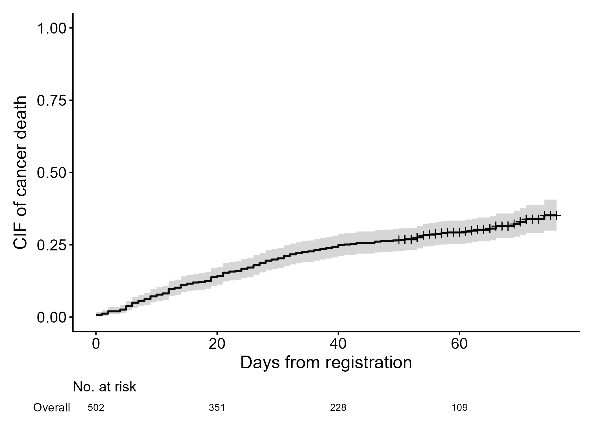

```{r, include = FALSE}
knitr::opts_chunk$set(
  collapse = TRUE,
  comment = "#>",
  fig.path = "figures/getting-started-",
  out.width = "100%"
)
```


あなたが統計解析を行う作業領域と、AIエージェントがアクセスする領域を、簡単に分けたいと思ったことはありませんか？あるいは、RStudioとChatGPTを何度も往復する作業に疲れていませんか？このサイトでは、AI支援型Rワークフローを紹介しています。

重要なのは、AIにいきなり解析を頼まないことです。このワークフローはいくつかのシンプルな原則に従っています。

- AIエージェントとRStudioの作業空間を分離する
- プランニングとコーディングを分離する
- 統計解析ワークフローに品質管理（QC）を組み込む
- 統計解析ワークフローの作業記録を支援する
- ユーザーは意思決定、結果解釈、アウトプットについて責任を持つ

これから紹介する`airsetup`パッケージは、AIエージェントが支援するRワークフローのためのフォルダ構造を生成します。統計解析のための関数は提供されませんが、その代わりフォルダ、最小限のAGENTS.md、QC_STATUS.mdトラッカー、そしてオプションとして軽快なQCスキルテンプレートが用意されています。

コーディングの正確性を確認し、QCを行う方法は1つではありません。あるプロジェクトではダブルプログラミングを採用するかもしれませんし、別のプロジェクトでは目視チェックを行うかもしれません。AI & Rワークフローにおける自己QCをサポートするために、3つのQCスキルテンプレートが用意されています。

-  `QC_SKILL_CONTEXT.md`: 計画のドラフトやRコーディングに先立って、コンテキスト情報が明確かどうかを確認します
-  `QC_SKILL_PLAN.md`: コーディング計画または統計解析計画（SAP）が、Rで実装するためにじゅうぶんな情報を持っているかどうかを確認します。
-  `QC_SKILL_RESULT.md`: 解析結果が内部的に一貫しており、計画に沿ったもので、安全に解釈できるかどうかを確認します

## ステップ0. R、RStudio、Codexをインストール

- R本体をインストールする
- RStudioインストーラーを[Positサイト](https://posit.co/downloads)からダウンロード
- Codexインストーラーを[OpenAIサイト](https://openai.com/ja-JP/codex)からダウンロード

## ステップ1. プロジェクトフォルダ作成（airsetup）

- `airsetup()`を実行してフォルダとマークダウンファイルを作成する
  - `AGENTS.md`
  - `QC_STATUS.md`
- `AGENTS.md`を通じて、AI作業領域とR作業領域を分離し、品質管理を行うようにAIに指示する
- `airskill()`を実行して、QCスキルテンプレートを作成する（オプション）
  - `QC_SKILL_CONTEXT.md`
  - `QC_SKILL_PLAN.md`
  - `QC_SKILL_RESULT.md`
  - `SKILLS_INDEX.md`

```{r step1, eval = FALSE}
library(airsetup)

root_dir <- "C:/demo"
ai_visible_dir <- "C:/demo/ai_project/ai_visible_data"
ai_hidden_dir <- "C:/demo/r_project/ai_hidden_data"
source_dir <- "C:/demo/ai_project/source"

airsetup(root_dir)
airskill(root_dir)
```


## ステップ2. プロジェクトフォルダへのファイル格納
- AIがアクセスできるダミーデータと非公開の実データを、対応するフォルダ構造に配置する
- このデモでは、ダミーデータとして、`cifmodeling`パッケージに含まれているデータフレームから抽出した、最初の3行を用いる
- 以下のRコードによって、コンテキスト・ダミーデータがプロジェクトフォルダに格納されるはずである

```{r step2, eval = FALSE}
# データの冒頭と構造を確認
library(cifmodeling)
data(prostate, package = "cifmodeling")
head(prostate)
str(prostate)

# R実行用のデータ保存
ai_visible_dir <- "C:/demo/ai_project/ai_visible_data"
ai_hidden_dir <- "C:/demo/r_project/ai_hidden_data"
source_dir <- "C:/demo/ai_project/source"

demodata <- prostate
out_file <- file.path(ai_hidden_dir, "demodata.rds")
saveRDS(demodata, out_file)

# AIが構造確認に用いるダミーデータ保存
demodata <- head(demodata, 3)
out_file <- file.path(ai_visible_dir, "demodata.rds")
saveRDS(demodata, out_file)

# AIのコンテキスト情報としてRdを保存
rd_list <- tools::Rd_db(package = "cifmodeling")
rd_name <- grep("prostate", names(rd_list), value = TRUE)
rd <- rd_list[[rd_name[1]]]
tools::Rd2txt(
  rd,
  out = file.path(source_dir, "data_definition_demodata.txt")
)
rd_list <- tools::Rd_db(package = "cifmodeling")
rd_name <- grep("cifplot", names(rd_list), value = TRUE)
rd <- rd_list[[rd_name[1]]]
tools::Rd2txt(
  rd,
  out = file.path(source_dir, "help_cifplot.txt")
)
```

## ステップ3. Codexプロジェクトの開始


- Codexを起動し、プロジェクトフォルダとしてai_projectフォルダを指定する
- Codexにプロンプトを入力する

```text
プロンプト「プロジェクトフォルダ内のファイルを確認してください」
```

## ステップ4. ユーザーとCodexによるコーディングプランの確認
- Codexにプロンプトを入力する
- Rスクリプトのコーディングプランを立てさせ、チャットを通じてプランが適切かどうか確認する

```text
プロンプト「demodata.rds、data_definition_demodata.txt、help_cifplot.txtを参照してください。
関心イベントはがん死亡です。がん死亡以外の死亡は競合リスクとして扱います。イベント変数 epsilon の
コーディングは、0 = alive/censored、1 = cancer death、2 = non-cancer death の予定です。
まずQCスキルを使い、コンテキストがRコーディングに進めるほど明確かどうか評価してください」
```

```text
プロンプト「QCの結果を踏まえて、Rスクリプトのコーディングプランを立ててください」
```

```text
プロンプト「QCスキルを使い、コーディングプランを評価してください」
```

## ステップ5. CodexによるRコーディングとQC
- Codexにプロンプトを入力する
- Rスクリプトをコーディングさせ、必要に応じてチャットで質問を行い、正しいかどうか確認する

```text
プロンプト「Rスクリプトを書いてください。AI確認用ダミーデータ用のRスクリプトと
R実行用の実データ解析スクリプトの両方が必要です。RStudioの作業ディレクトリに注意してください。
手動で指定する必要がない方が望ましいです」
```

## ステップ6. RStudioによるR実行


- ai_outputに生成されたRスクリプトをRStudioに読み込ませて、実行する
- RStudioの作業ディレクトリに注意すること。作業ディレクトリに依存するコードは、環境によって動かないことがある
- その場合は、入力するデータセットの場所を指定すると解決するかもしれない

```r
options(DEMODATA_RDS = "C:/demo/r_project/ai_hidden_data/demodata.rds")
```
- または、作業ディレクトリを手動で設定することもできる

```r
setwd("C:/demo/r_project/ai_hidden_data")
```

## ステップ7. ユーザーとCodexによる結果の確認
- ai_outputに生成されたCIF曲線を確認する
- Codexのサポートを受けながら、解析結果が正しいか最終レビューを行う




